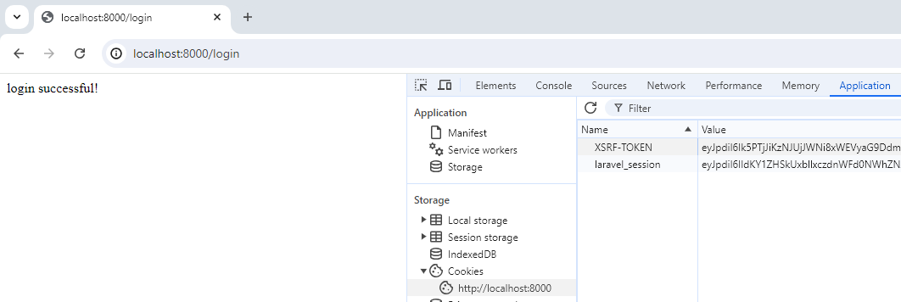

# 5- Authentication Basics

## logging in

first create the ui for logging in.

```php
<form action = "/login" method="POST">
    @csrf
    <label>username</label>
    <input name="loginUsername"></input>

    <label>password</label>
    <input name="loginPassword"></input>

    <button>log in</button>

</form>

```

in web.php

```php
Route::post('/login', [UserController::class, 'login']);
```

in UserController

```php
public function login(Request $request)
    {
        $incomingFields = $request->validate([
            'loginUsername' => 'required',
            'loginPassword' => 'required',
        ]);

        if (auth()->attempt(['username' => $incomingFields['loginUsername'], 'password' => $incomingFields['loginPassword']])) {

            $request->session()->regenerate();

            return 'login successful!';

        } else {
            return 'login failed!';
        }
        // to understand the table class name, go to auth in config folder and check providers
        // auth returns an object
    }

```



But this value is what proves to the Laravel server that we are the user that we just logged in with. they automatically get sent along from the browser to the server on every single request just automatically

in logged in page we would want to conditionally change the header. go to welcome.blade.php

```php
<body>

    @auth
        <p>user page</p>
    @else
        <p>home page</p>
    @endauth

    <form action = "/register" method="POST">
```

in web.php

```php
Route::get('/', [UserController::class, 'correctWelcome']);
```

go to UserController

```php
public function correctWelcome()
{
    if (auth()->check()) {
        return view('welcome-feed');
    } else {
        return view('welcome');
    }
}
```

```php
public function register(Request $request)
{

    $incomingFields = $request->validate([
        'username' => ['required', 'min:3', 'max:20', Rule::unique('users', 'username')],
        // in unique, Laravel will look in our database
        'email' => ['required', 'email', Rule::unique('users', 'email')],
        'password' => ['required', 'min:8', 'confirmed'],
        // this is how Laravel can automatically make sure that password and confirm password are match.
    ]);
    // User::create($incomingFields);
    // This is actually going to return that user
    $user = User::create($incomingFields);
    auth()->login($user);
    return redirect('/')->with('success', 'Thanks for registering');
}
```

```php
public function login(Request $request)
{
    $incomingFields = $request->validate([
        'loginUsername' => 'required',
        'loginPassword' => 'required',
    ]);

    if (auth()->attempt(['username' => $incomingFields['loginUsername'], 'password' => $incomingFields['loginPassword']])) {

        $request->session()->regenerate();

        // return 'login successful!';
        return redirect('/')->with('success', 'You have successfully logged in');
        // The first argument we get to make up a name for this type of message
    } else {
        return redirect('/')->with('failed', 'your username or password is incorrect');
    }
    // to understand the table class name, go to auth in config folder and check providers
    // auth returns an object
}
```

in welcome-feed:

```html
<p>welcom {{ auth()->user()->username }}</p>
```

## logging out

in welcome-feed.blade.php

```php
<form action="/logout" method="POST">
    @csrf
    <button>log out</button>
</form>
```

It should actually destroy your session and

go to web.php

```php
Route::post('/logout', [UserController::class, 'logout']);

```

go to UserController

```php
public function logout()
{
    auth()->logout();
    return 'logout successful!';
}
```

!!! csrf -> 2. Logging Out & Misc Details -> 3:29

So now let's improve the user experience by redirecting, So in other words, when I click sign out, I don't want to be taken to that awkward slash logout URL, Let's just redirect to the home page

go to UserController

```php
public function logout()
{
    auth()->logout();
    return redirect('/');
}
```

```php
// return 'login successful!';
return redirect('/');
```

Let's learn how to show a message when you redirect. So like when I log in, we would want to show a message here that says, Congrats, you are now signed. in and then as soon as you refresh, that message would go away. Typically in the industry, we call that a flash message, right

go to UserController

```php
// return 'login successful!';
return redirect('/')->with('success', 'You have successfully logged in');
// The first argument we get to make up a name for this type of message
```

and also for log out:

```php
return redirect('/')->with('success', 'You are now logged out');
```

And now we need to go tell our HTML blade template what to actually do with this or where to display it.

check to see if the current session data has a message with the label that we made up of success

```php
@if (session()->has('success'))
    <p style="color: green;">
        {{ session('success') }}
    </p>
@endif
```

do this for failed login

do fo registration:

```php
return redirect('/')->with('success','Thanks for registering');
```

And actually let's take things one step further, So when you create a new user account, instead of just sending them back to the home page, let's log them in automatically with the user account that they just created. To do that, all we would need to do is log them in before we redirect them.
