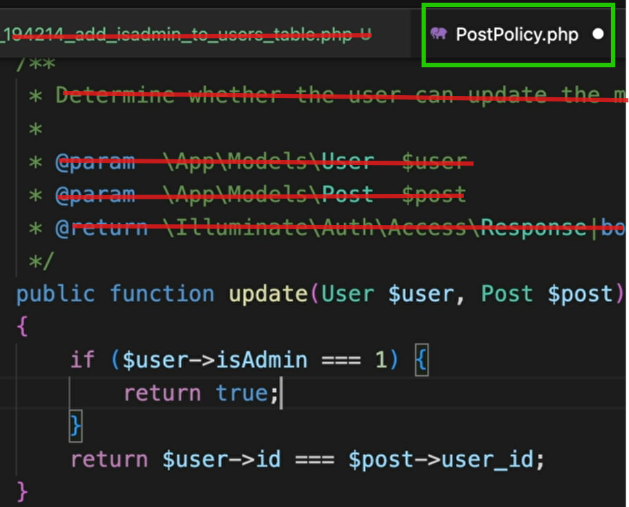

# Blog Posts

go to web.php

```php
Route::get('/create-post', [PostController::class, 'showCreateForm']);
```

```bash
php artisan make:controller PostController
```

got to PostsController

```php
public function showCreateForm()
{
    return view('create-post');
}
```

in welcome-feed.blade.php

```php
<a href="/create-post">create post</a>
```

create a new file in view create-post.blade.php

```php
<form action="/create-post" method="POST">
    @csrf
    <input name="title"></input>
    <textarea name="body"></textarea>
    <button>post</button>
</form>
```

go to web.php

```php
Route::post('/create-post', [PostController::class, 'storeNewPost']);

```

go to PostController

```php
public function storeNewPost()
{
    return 'you post';
}
```

so now we would actually want to store something in the database

```bash
php artisan make:migration create_post_table
```

```php
$table->id();
$table->timestamps();
$table->string('title');
$table->longText('body');
$table->foreignId('user_id')->constrained()->onDelete('cascade');
// So Laravel will see this and it will know that what comes before the underscore
// So "user" that's the name of the model in the table that we're trying to look at
// And then whatever comes after the underscore that's the name of the column or the field
// constrained: And what this is going to do is Laravel won't even let you create a blog post if the
// author value that you provide here doesn't actually exist in the user's table
// onDelete('cascade'): let's say if Brad had ten blog posts,
// but then you deleted the Brad user account,
// you could have that delete action cascade so that when you delete the Brad user,
// all ten of his blog posts get deleted automatically.
```

in PostController

```php
public function storeNewPost(Request $request)
{
    $incomingFields = $request->validate([
        'title' => 'required',
        'body' => 'required',
    ]);
    // I want to strip out any HTML tags that a malicious user might try to add
    $incomingFields['title'] = strip_tags($incomingFields['title']);
    $incomingFields['body'] = strip_tags($incomingFields['body']);
    $incomingFields['user_id'] = auth()->id();

    return 'you post';
}
```

let's go ahead and create a blog post model or a post model

```bash
php artisan make:model Post
```

go to that model

```php
protected $fillable = ['title', 'body', 'user_id'];
```

in PostController

```php
public function storeNewPost(Request $request)
{
    $incomingFields = $request->validate([
        'title' => 'required',
        'body' => 'required',
    ]);
    // I want to strip out any HTML tags that a malicious user might try to add
    $incomingFields['title'] = strip_tags($incomingFields['title']);
    $incomingFields['body'] = strip_tags($incomingFields['body']);
    $incomingFields['user_id'] = auth()->id();
    Post::create($incomingFields);


    return 'you post';
}
```

clint-side validation:

```php
<input required name="title"></input>

```

That is a good start, but you can't fully trust client side validation like that.

##

So instead of being taken to this awkward create post screen where it just says, Hey, it would make way more sense if we redirected the user to the new URL for that new post. In other words, you create a brand new post I think it should take the user automatically, for example 127.0.0.1:8000/post/1(ID number for that new post)

go to web.php

```php
Route::post('/post/{postId}', [PostController::class, 'viewSinglePost']);
// agar man dar browser vared kardam "/post/4" meghdari ke inja gharar migirad hamin ast
```

go to PostController

```php

// public function viewSinglePost()
// {
//     return view('single-post');
// }

public function viewSinglePost(Post $postId)
// However, if you make the names match and we start to use the power of a model,
// Laravel can perform database lookups for us
// this syntax is called type hinting
// We're hinting to Laravel that whatever this incoming value is,
// we want to interpret it through the lens of what is a blog post, our post model
// Laravel can look up the appropriate post in the database just based on this incoming ID value

{
    // return $postId->title;
    return view('single-post', ['title' => $postId->title]);
}
```

Now the username(not user id) of who created the post. Well, Our database knows that this is a foreign key but laravel not. We need to go into our blog post model and spell out the relationship that's based upon this user ID column.

go to Post.php (model)

```php
<?php

namespace App\Models;

use Illuminate\Database\Eloquent\Factories\HasFactory;
use Illuminate\Database\Eloquent\Model;

class Post extends Model
{
    use HasFactory;

    protected $fillable = ['title', 'body', 'user_id'];

    // you can name it anything
    public function user()
    {
        // return a relationship
        return $this->belongsTo(User::class, 'user_id');
        // tozihat dar paein
        // the second argument is the column name that the relationship is powered by
    }
}

/*
<?php

class simple {

public $k = 9;

public function change($val){
$this->k = $val;
}

}

$obj = new simple();

$obj->change(8);
// rahe digei be nazaret mirese ke $k ro avaz kon

?>
*/

```

got to PostController

```php
    return view('single-post', ['title' => $postId->user->username]);

```

for redirect to the post that was created

got to PostController go to storeNewPost method

```php
$newPost = Post::create($incomingFields);

// return 'you post';
return redirect("/post/{$newPost->id}");
```

## middleware

go to incognito and go to for example http://127.0.0.1:8000/post/2 ...

So before we even get into the concept of what is middleware, we already have the tools to perform this check, right. We would just want to redirect a non logged in user who visits this URL back to the homepage URL.

go to PostController and showCreateForm

```php
public function showCreateForm()
{

    if (!auth()->check()) {
        return redirect("/");
    }

    return view('create-post');
}
```

there's a better tool. Because what if we don't want to have to spell out code like this? if check across five different routes or ten different routes in our controller that would be really repetitive. Also, what if we never even wanted this overall controller function (showCreateForm) to even be executed in the first place at all?

go to web.php

```php
Route::get('/create-post', [PostController::class, 'showCreateForm'])->middleware('auth');
// for get rid of the error, because you and I have not named(label) one of our routes as "login" yet
Route::get('/', [UserController::class, 'correctWelcome'])->name('login');
Route::post('/register', [UserController::class, 'register'])->middleware('guest');
```

now to create our own middleware:
So, for example, even though the auth middleware is doing basically exactly what we would want it

```bash
php artisan make:middleware MustBeLoggedIn
```

so go to that middleware:

So remember when we said middleware is like these different layers of a route that a request passes through And remember back in our routes file, we said that before our function on our controller ever runs the request first needs to pass through the middleware Well, $next is how the request passes through to the next layer. So in other words, if we don't add any code here, this middleware wouldn't be doing anything

```php
public function handle(Request $request, Closure $next): Response
{
    if (auth()->check()) {
        return $next($request);
    }

    return redirect('/');

}
```

we do need to tell Laravel that, hey, our brand new middleware exists. to do that go to bootstrap/app.php

```php
->withMiddleware(function (Middleware $middleware) {
    //
    $middleware->alias(['mustBeLoggedIn' => MustBeLoggedIn::class]);
})

```

## see posts

web.php:

```php
Route::get('/profile/{username}', [UserController::class, 'profile']);
```

UserController:

```php
public function profile()
{
    return view('profile-posts');
}
```

welcome-feed.blade.php:

```php
<a href="/profile/{{ auth()->user()->username }}">profile</a>
```

again

web.php:

```php
Route::get('/profile/{user:username}', [UserController::class, 'profile']);
//  When Laravel is going to look up something in the database for you like this
// by default, it's going to try to look it up based on its ID number
// However, we're not giving it an ID number, right
// hear 'user:username' -> looking up based upon the username
```

UserController:

```php
public function profile(User $user)
{

    // return auth()->user();

    return view('profile-posts',
        ['user' => $user,
            'posts' => $user->posts()->latest()->get(),
            'count' => $user->posts()->count()]);
    // latest: sort by latest
}
```

User.php (model):

```php
public function posts()
{
    return $this->hasMany(Post::class, 'user_id');
}
```

profile-posts.blade.php:

```php
<body>
    <h1>{{ $user->username }}</h1>

    <p>num of posts: {{ $count }}</p>
    <ul>
        @foreach ($posts as $post)
            <li><a href="/post/{{ $post->id }}">{{ $post->title }}: {{ $post->body }}</a></li>
        @endforeach
    </ul>
</body>
```

## update and delete posts

### delete

profile-post.blade.php:

```php
<body>
    <h1>{{ $user->username }}</h1>

    <p>num of posts: {{ $count }}</p>
    <ul>
        @foreach ($posts as $post)
            <li><a href="/post/{{ $post->id }}">{{ $post->title }}: {{ $post->body }}</a>

                @if (auth()->user()->id === $user->id)
                    <a>edit</a>
                    <a>delete</a>
                @endif

            </li>
        @endforeach
    </ul>
</body>
```

with policies:

```bash
php artisan make:policy PostPolicy --model=Post ???
```

app -> policies

So now if you think of any of the CRUD actions that have to do with a blog post, there are functions in this file. So the idea is within any of these functions you just return either true or false regarding whether

```php
public function update(User $user, Post $post): bool
{
    return $user->id === $post->user_id;
}
```

do for delete function

And now the question is how do we actually leverage that post policy? go to profile-posts.blade.php

```php
@foreach ($posts as $post)
    <li><a href="/post/{{ $post->id }}">{{ $post->title }}: {{ $post->body }}</a>

        @can('update', $post)
            <a href="#">edit</a>
            <a href="#">delete</a>
        @endcan

    </li>
@endforeach
```

now for perform editing and deleting. there are two different ways that you could handle this. Number one, you could check our policy in your controller method, right? or option number two, you can check your policy in The route's file right through a middleware call.

controller:

go to PostsController

```php
public function delete(Post $post)
{
    if (auth()->user()->cannot('delete', $post)) {
        return 'you are not allowed to delete this post';
    }

    $post->delete();

    return redirect('/profile/' . auth()->user()->username);
}
```

go to web.php

```php
Route::delete('/post/{post}', [PostController::class, 'delete']);
```

go to profile-post.blade.php

```php
@foreach ($posts as $post)
    <li><a href="/post/{{ $post->id }}">{{ $post->title }}: {{ $post->body }}</a>

        {{-- @if (auth()->user()->id === $user->id)
            <a>edit</a>
            <a>delete</a>
        @endif --}}

        @can('update', $post)
            <a href="#">edit</a>
        @endcan

        {{-- @can('delete', $post) --}}
        <form action="/post/{{ $post->id }}" method="POST">
            @csrf
            @method('DELETE')
            <button>delete</button>
        </form>
        {{-- @endcan --}}

    </li>
@endforeach
```

through routing or middleware: ???

go to PostsController

```php
public function delete(Post $post)
{
    $post->delete();

    return redirect('/profile/' . auth()->user()->username);
}
```

go to web.php

```php
Route::delete('/post/{post}', [PostController::class, 'delete'])->middleware('can:delete, post');
```

### edit

let's go set up a view template a blade template for the edit post screen

edit-post.blade.php:

```php
<body>
    <form action="/post/{{ $post->id }}" method="POST">
        @csrf
        @method('PUT')
        <input name="title" value="{{ $post->title }}"></input>
        <textarea name="body">{{ $post->body }}</textarea>
        <button>save change</button>
    </form>
</body>
```

profile-post.blade.php:

```php
<a href="/post/{{ $post->id }}/edit">edit</a>

```

web.php:

```php
Route::get('/post/{post}/edit', [PostController::class, 'showEditForm']);
Route::put('/post/{post}', [PostController::class, 'edit']);
```

PostController.php:

```php
public function showEditForm(Post $post)
{

    if (auth()->user()->cannot('update', $post)) {
        return 'you are not allowed to update this post';
    }

    return view('edit-post', ['post' => $post]);
}
```

```php
public function edit(Post $post, Request $request)
{
    $incomingFields = $request->validate([
        'title' => 'required',
        'body' => 'required',
    ]);
    $incomingFields['title'] = strip_tags($incomingFields['title']);
    $incomingFields['body'] = strip_tags($incomingFields['body']);

    $post->update($incomingFields);

    // return redirect('/profile/' . auth()->user()->username);
    return back();    // So it'll take the visitor to the URL they just came from previously

}
```

## How To Setup Moderator Permissions with policy

how to set up one of our user accounts as an admin or moderator user, and they should have permission to update and delete anyone's blog posts. normally he don't see the edit and delete icons


