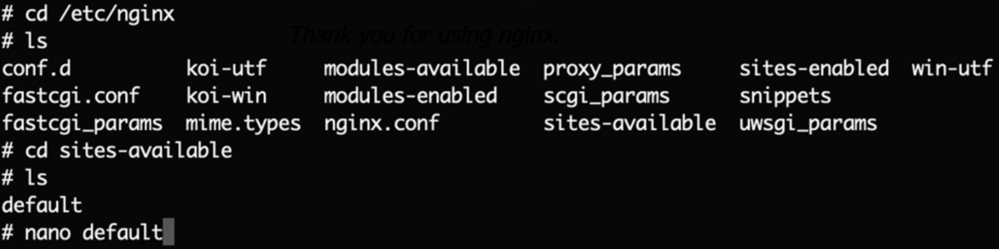
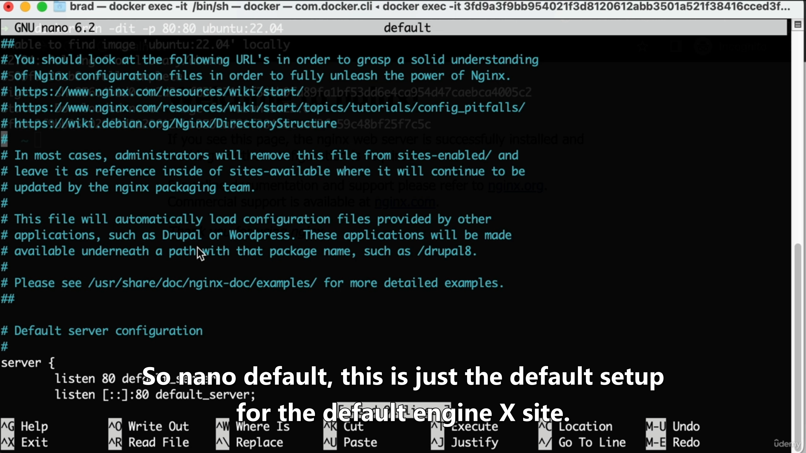
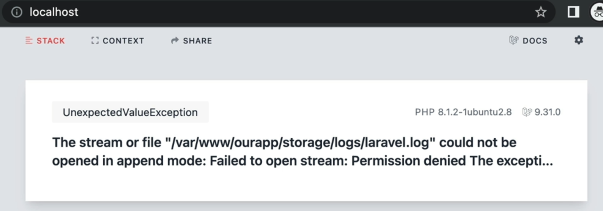

# Udemy - Let's Learn Laravel A Guided Path For Beginners 2023

## Configuration

All of the configuration files for the Laravel framework are stored in the config directory.

Laravel can display an overview of your application's configuration, drivers, and environment via the about Artisan command.

```bash
php artisan about
```

Or, to explore a specific configuration file's values in detail, you may use the config:show Artisan command:

```bash
php artisan config:show database
```

You may easily access your configuration values in config/something.php in using:

```php
// Retrieve a default value if the configuration value does not exist...
$value = config('app.timezone', 'Asia/Seoul');
```

To set configuration values at runtime,

```php
config(['app.timezone' => 'America/Chicago']);
```

To give your application a speed boost, you should cache all of your configuration files into a single file using the `config:cache` Artisan command.

You should typically run the php artisan config:cache command as part of your production deployment process. The command should not be run during local development as configuration options will frequently need to be changed during the course of your application's development.

Once the configuration has been cached, your application's .env file will not be loaded by the framework during requests or Artisan commands; therefore, the env function will only return external, system level environment variables.

For this reason, you should ensure you are only calling the env function from within your application's configuration (config) files. Configuration values may be accessed from anywhere in your application using the config function described above.

### Configuration Publishing

Most of Laravel's configuration files are already published in your application's config directory; however, certain configuration files like cors.php and view.php are not published by default, as most applications will never need to modify them.

However, you may use the config:publish Artisan command to publish any configuration files that are not published by default:

```bash
php artisan config:publish

php artisan config:publish --all
```

### dotenv

If you are developing with a team, you may wish to continue including and updating the .env.example file with your application. By putting placeholder values in the example configuration file, other developers on your team can clearly see which environment variables are needed to run your application.

#### Additional Environment Files

Before loading your application's environment variables, Laravel determines if an APP_ENV environment variable has been externally provided or if the --env CLI argument has been specified. If so, Laravel will attempt to load an .env.[APP_ENV] file if it exists. If it does not exist, the default .env file will be loaded.

```bash
php artisan config:cache --env=local
```

#### Encrypting Environment Files

Unencrypted environment files should never be stored in source control. However, Laravel allows you to encrypt your environment files so that they may safely be added to source control with the rest of your application.

```bash
PS D:\projects\blureen-laravel> php artisan env:encrypt --env=local

  What encryption key would you like to use? [Generate a random encryption key]
  Generate a random encryption key ........................................................................................................ generate
  Provide an encryption key .................................................................................................................... ask
❯

   INFO  Environment successfully encrypted.

  Key .......................................................................................... ***
  Cipher ............................................................................................................................... AES-256-CBC
  Encrypted file .................................................................................. D:\projects\blureen-laravel\.env.local.encrypted
```

```bash
PS D:\projects\blureen-laravel> php artisan env:encrypt --env=production

  What encryption key would you like to use? [Generate a random encryption key]
  Generate a random encryption key ........................................................................................................ generate
  Provide an encryption key .................................................................................................................... ask
❯

   INFO  Environment successfully encrypted.

  Key .......................................................................................... ***
  Cipher ............................................................................................................................... AES-256-CBC
  Encrypted file ............................................................................. D:\projects\blureen-laravel\.env.production.encrypted
```

```
PS D:\projects\blureen-laravel> php artisan env:decrypt --env=local

  What is the decryption key?
❯


   INFO  Environment successfully decrypted.

  Decrypted file ............................................................................................ D:\projects\blureen-laravel\.env.local
```

## Commands

```bash
php artisan serve --host=somedomain.com --port=8001
```

---

## Migration

instead of

```php
$table->foreignId('user_id');
```


## Seeder

```php
DB::table('users')->insert([
    'id' => 1,
    'username' => 'brad',
    'email' => 'brad@local',
    'password' => Hash::make('qwertyqwerty'), // pay attention to this
    'isAdmin' => 1
]);

```

## Middleware

Path: \bootstrap\app.php


```bash
php artisan make:middleware MiddleWareName
```


## Policy

Path: app/policies

```bash
php artisan make:policy ModelNamePolicy –-model=ModelName
```


## Moderator and gate

Path: app/policies


## Gate

Path: app/providers/AuthServiceProvider


## Request


## php basics


## Register


## Log in


## Log out


## Repository

```php
Auth()->user()->username or id
```


```php
$user -> delete()
$user -> update($incomingFields)
```

---


Let's say in your user table you have a field that is user_type and that can have values of user / admin

Obviously, you don't want users to be able to update this value. someone could inject into a form a new field for user_type and send 'admin' along with the other form data, and easily switch their account to an admin account... bad news.

By adding:

```php
$fillable = ['name', 'password', 'email'];
```

You are ensuring that only those values can be updated using mass assignment

To be able to update the user_type value, you need to explicitly set it on the model and save it, like this:

```php
$user->user_type = 'admin';
$user->save();
```

---

```php
$existCheck = Follow::where(some query)->count(); // pay attention to count!
```

> ```php
> $user->isEmpty(); // pay attention to isEmpty()!
> ```

> 

## models


### query scopes

https://laravel.com/docs/11.x/eloquent#query-scopes

## Relations


## Search

show us all blog posts that contain the word "Brad". we're not saying, only show us posts where the entire value for the title column is literally nothing but the word "Brad", We're trying to say if the value in there if at any point it contains the word "Brad" inside it. Now, there are many different ways to accomplish this


```bash
composer require laravel/scout
```

> ```bash
> php artisan vendor:publish --provider="Laravel\Scout\ScoutServiceProvider"
> ```
>
> Laravel will look for any publishable resources (such as configuration files, views, assets, translations, or migrations) that have been tagged by the service provider named "SomeThing" and copy them from the package’s directory into your application. This allows you to customize and override package resources in your own project without modifying the package’s source code. Essentially, it "publishes" the package’s files into your app’s directory structure, making them accessible for further development or customization.


> in .env file:
> 
> this is one of the search solutions and we have more: algolia and ...


## Events and listeners


```bash
php artisan event:generate
```


## Chat - Broadcasting

## Email - Sending Email

## Adding jobs to the Queue (Async)

```bash
php artisan make:job SendNewPostEmail
```

> 
> essentially in this job file This is where we would want to send the email, not in our post controller


> 
> don't forget:
>
> ```php
> public $incoming;
> ```


> ```bash
> php artisan queue:work
> ```
>
> If you don't have that task up and running, Laravel is just going to keep adding new jobs to the queue

## Scheduling tasks


```bash
php artisan schedule:work
```

## Cache

What if that was a complex or expensive or slow query to run. The idea is that every single time someone refreshes the home page, we would not want to have to run that query again and again and again

How long do you want it to stay in the cache?

if you're retrieving data from some sort of third party API where it's going to require a network request on your end

## API Authentication

## Going Live Practice

VPS let you set up a brand new fresh Linux box that you are in 100% complete control over.

Now, you might be saying though, Brad that's cool, but I don't want to learn about Linux and the command line and how to SSH into a machine and a server. there's a great option and it's the official Laravel option called Forge So with Forge, you would still have to connect your Laravel Forge account to your digital ocean(vps) account But the idea is that Laravel Forge, the official Laravel Solution, it will connect to those services and it will provision and create a Linux server from scratch So it will set up everything for you It will create the perfect environment, and then you just push your Laravel source code files up and the rest is taken care of for you.

### Docker

**this is not how you would ever use Docker quote, in the real world.** And I'm purposely going to go against all of the Docker best practices. So we're going to break all of those Docker best practices. **We're going to use our imagination that our Docker container is a VPS server**

when it comes time to actually host your application for real on a public server somewhere, well, you wouldn't just run `PHP artisan serve` You would want to set up a real web host that just hosts your application by default without you running any commands.

in terminal command this:

> ```bash
> docker run -dit -p 80:80 ubuntu:24.04
> ```
>
> - -d (detached mode): Runs the container in the background, allowing you to continue using the terminal.
>
> - The combination of -i and -t (-it) is commonly used to interact with containers via the command line. port 80 in our container is available as port 80 on our host machine. This means that any network traffic sent to port 80 on the host will be directed to port 80 in the container.

go into the docker desktop application. And now if you click on images in the left hand sidebar ...

But better yet, if you click on containers in the left hand sidebar. So what we want to do now is just open a command line interface for this container. So what I like to do is to just click on the name. Well, then you can click terminal here. Or better yet, I like to use this option here that says open an external terminal.

let's install a web server. I'm a big fan of the web server that's called nginx, so you can do this with me

```bash
sudo apt update
sudo apt install nginx
```

Now, if we were on a real actual Linux computer nginx would start up automatically. But because we're in a Docker container So we need to go manually start up our web server

```bash
/etc/init.d/nginx start #init.d folder and nginx command
```


This is just the default welcome or starter site that's being hosted, we can create a new site for nginx to host

now we want to install some necessary tools:
php:

> 
>
> - php-cli: run php code in command line interface
> - php8.1-gd: This is a graphics library that's used for when we resize avatar image uploads
> - FPM (FastCGI Process Manager) is a primary PHP FastCGI implementation containing some features (mostly) useful for heavy-loaded sites.

install composer ...

install mysql ...
if we were using a real actual Linux VPS, mySQL would just start automatically anytime you reboot the system

```bash
/etc/init.d/mysql start
```

moving our source code files onto out VPS(docker container): open up the windows command line

in docker:

```bash
docker cp /User/brad/Desktop/laravel-projects/ourmainapp cranky_franklin:/var/www/ourapp #cranky_franklin: our container name
```

> 
> you can see that nginx by default has an HTML folder that is what contains the files for this default Welcome to nginx project

So what we need to do now is simply, instead of just serving up this default website, we want nginx to serve up our new files. We want to serve the "public" folder. be more specific, We want to serve the public folder. Now, don't worry, when we go through the lesson where we actually set this up on a real vps, I'll show you how to enable multiple websites within an engineX server. Because one server can host ten domains. But just for this simple Docker example I'm actually just going to edit the default file for this default engineX site. Let me show you what I have in mind





I'm actually going to completely erase this configuration and we're just going to paste in our own. The idea is that this is where you say, Hey engineX, I want to use PHP and so on and so forth

```bash
rm default
touch default
```

At this point we just need to restart engineX so that it uses that new configuration file

```bash
/etc/init.d/nginx restart
```

Also let's start up our PHP service

```bash
/etc/init.d/php8.1-fpm start
```

At this point, we should be able to visit our Laravel application



So this first error message that we see from Laravel is just that our storage folder does not have the correct permissions. We want to give the storage folder proper permissions

```bash
chown -R www-data:www-data storage
```

to change max_file_uploads

```bash
nano /etc/php/8.1/fpm/php.ini
```

search for upload_max_filesize

you would need to restart your PHP service

```bash
/etc/init.d/php8.1-fpm restart
```

go to .env

```dotenv
APP_ENV=production
APP_DEBUG=false
```

even if I start the container, I'm still not able to visit local host in the browser. Now, this would never happen in a real VPS, but because we're using a Docker container, Docker containers, do not have an init system, So in other words, when you restart the container, it's not going to automatically start the PHP service in the background or the MySQL database in the background or the engineX web server in the background.

ok open the container terminal and it would run all of these for me. I would create a new file

```bash
/etc/init.d/mysql start
/etc/init.d/php8.1-fpm start
/etc/init.d/nginx start
```

it is good to create a startup script file and then I could just run one single command and

```bash
touch /ourstartup
nano /ourstartup
```

And in this file, we're just going to create a bash script

```bash
#!/bin/bash
/etc/init.d/mysql start
/etc/init.d/php8.1-fpm start
/etc/init.d/nginx start
```

Now we do need to make that file executable

```bash
chmod u+x /our
```

now if we stop and again start container, we just

```bash
/ourstartup
```

At this point, let's go ahead and set up an automated way to run our queue worker and also our schedule worker. you don't want to have to manually run this every time your server boots up. So to make that happen, we're going to install something called cron.

```bash
sudo apt install cron
```

And now that we have Cron installed, we just want to add a job and we can specify when or how often it should be called.

```bash
crontab -e
```

this is essentially saying every minute:
We want to spell it out in a way using absolute paths:

```
* * * * * /usr/bin/php /var/www/ourapp/artisan queue: work --max-time=60
* * * * * /usr/bin/php /var/www/ourapp/artisan schedule:run
```

And then we don't just want to let it run forever, Let's just let it run for exactly one minute.
for schedule: This one is a bit different We don't need to include max time because this doesn't just run in the background forever, Instead it just runs, it does its job and then it's done. We're just going to recall it once every minute to see if there's any scheduled jobs that need to be called cool.
And now we just need to tell the cron job service to actually run in the background

```bash
/etc/init.d/cron start
```

and now, we add cron to /appstartup:

```bash
#!/bin/bash
/etc/init.d/mysql start
/etc/init.d/php8.1-fpm start
/etc/init.d/nginx start
/etc/init.d/cron start
```

For our final detail in this lesson I want to use Redis

```bash
sudo apt install redis-server
composer require predis/predis
```

in .env

```dotenv
CACHE_DRIVER=redis
QUEUE_CONNECTION=redis
REDIS_CLIENT=predis
```

```bash
/etc/init.d/redis-server start
```

and add to startup file

## Deploying To Actual VPS

Anyways, right now what we want to do is ssh or log in to this machine so that we can get into its command line and actually start doing something useful. So you can see right here there's SSH access and that's going to give you a command, But it's not rocket. let's go connect so you can open up a terminal on your computer
our user account is root:

```bash
ssh root@172.16.20.64
```

you are logged in now.
let's install engineX just because I want to be able to visit my IP address in my web browser. right now Currently, if I try to visit it, I see this site can't be reached and that's because this is a brand new, fresh computer It's not listening for incoming requests It's it's not a web server by default. We want to begin listening on Port 80, Now, don't worry, Eventually we'll set up HTTPS encryption And then we would also want to listen on Port 443.

```bash
sudo apt update
sudo apt install nginx
```

```bash
htop
```

if you run

```bash
exit
```

### Using A Domain

There seem to be some complications.(https://techdocs.akamai.com/cloud-computing/docs/getting-started-with-dns-manager#register-the-domain)

```bash
ssh root@yourDomainName.enyThing!
```

one VPS, one server could actually host like 10 or 20 or 100 different domains.
Because what if you bought ten different domains and you wanted all of them to be hosted on just this one $5 a month VPS box
we can manage it by nginx:

```bash
cd /etc/nginx
ls
```

you see that nginx has a folder called sites-available and sites-enabled So the idea is that you can create different sites, different projects or domains in the sites-available folder, and then you just create like a symbolic link or shortcut so that it also exists in sites-enabled

```bash
cd sites-available
ls
```

yes, there's just the one file named default. And that's what's powering sort of your default website when you visit the server on port 80 or in the future we'll visit 443 but port 8 for just http.
so that file named Default in sites-available, That's what we're seeing here.
However, what if you wanted to host multiple domains or sites from this one VPS.

```bash
touch mysite
nano mysite
```

```
server{
  listen 80;
  server_name mysite.com www.mysite.com;

  location / {
    root /var/www/mysite;
    index index.html;
  }
}
```

And now let's just go create a folder in that expected location

```bash
cd /var/www
ls
```

there's just the one folder named HTML. That HTML folder is what's powering this" Welcome to nginx default" screen.

```bash
mkdir mysite
cd mysite
mkdir index.html
nano index.html
```

```html
<!DOCTYPE html>
<html>
  <head>
    <title>My Site</title>
  </head>
  <body>
    <h1>Welcome to My Site</h1>
  </body>
</html>
```

```bash
cd /etc/nginx/sites-enabled
ls
```

So what we want to do now, to actually enable this new site is create a shortcut or a link so that this file virtually also lives in the site-enabled folder

```bash
sudo ln -s /etc/nginx/sites-available/mysite /etc/nginx/sites-enabled/ # ln for create a link and -s for symbolic link
```

```bash
sudo systemctl restart nginx
```

### using ssh keys instead of password

if there was just a file on my personal computer and then the server could just trust me.
Now, first of all, you might already have an SSH key on your computer. Let me show you how you can check for that. So first I'll show you If you were on windows

```bash
cd C:\Users\your_username\.ssh
```

Now inside that directory there are two files: id_ed25519 and id_ed25519.pub. The first one is your private key, and the second one is your public key. the file that ends in dot pub, it contains a value that you can share with trusted sources like, you know, GitHub, GitLab, Bitbucket or in our case, you know, our own $5 a month VPS.
let me show you how you could create one

```bash
mkdir .ssh
cd .ssh
ssh-keygen -t ed25519 -C "your_email@example.com"
```

```bash
code id_ed25519.pub
```

```bash
ssh root@your_domain_or_ip
```

```bash
cd ~
cd .ssh
ls
```

there's a file named authorized_keys.

```bash
nano authorized_keys
```

and then you just paste in the contents of your public key file, which is id_ed25519.pub

### The Environment That Laravel Needs

press ctrl + f and search for "now we want to install some necessary tools:"
install from php-cli to end.

### Using Git To Push Files To Our VPS

I don't want to ignore the public build folder(/public/build) because I'm happy to just run `NPM run build` on my local host computer and then just send those files over through git.
our VPS isn't set up yet for us to be able to push this repository to our VPS

```bash
ssh root@your_domain_or_ip
cd /var/www
mkdir ourapp # That is where our actual Laravel Files will live, that's not where we're going to push our files directly from our host computer
mkdir ourrepo
cd ourrepo
mkdir ourapp
cd ourapp
```

because vue-app owned by root, we need to change the <b>ownership</b> to our user account

```bash
sudo chown -R blureen:blureen /var/www/our-repo/vue
sudo chown -R blureen:blureen /var/www/vue
```

> عالی، بریم دقیق‌تر بررسی کنیم که این دستور `sudo chmod -R u+rwX path/` دقیقاً **چی کار می‌کنه، کجا استفاده می‌شه و چرا مهمه.**
>
> ---
>
> #### ✅ بررسی خط به خط دستور
>
> ```
>
> sudo chmod -R u+rwX path/
>
> ```
>
> ##### 1. `sudo`
>
> - یعنی اجرای دستور با **دسترسی مدیریتی (root)**.
> - برای تغییر مجوز فایل‌هایی که متعلق به کاربرهای دیگر (مثل `www-data`) هستند، نیاز به `sudo` داریم.
>
> ---
>
> ##### 2. `chmod`
>
> - دستور **تغییر مجوز فایل‌ها** (change mode).
> - مجوزها در لینوکس به سه دسته تقسیم می‌شن:
>
>   - **u** = user (مالک فایل)
>   - **g** = group (گروه فایل)
>   - **o** = others (بقیه)
>   - و می‌تونی از `+`, `-`, `=` برای افزودن، حذف یا ست کردن مجوز استفاده کنی.
>
> ---
>
> ##### 3. `-R`
>
> - یعنی recursive → روی **تمام فایل‌ها و پوشه‌های زیرمجموعه** هم اعمال بشه.
>
> ---
>
> ##### 4. `u+rwX`
>
> این بخش خیلی مهمه. بیایم تکه‌تکه بررسی کنیم:
>
> ###### 🔹 `u+`
>
> - یعنی این مجوزها به **مالک فایل** (user/owner) اضافه شود.
>
> ###### 🔹 `r` → Read
>
> - اجازه‌ی **خواندن فایل یا لیست‌کردن محتویات پوشه** را به مالک می‌دهد.
>
> ###### 🔹 `w` → Write
>
> - اجازه‌ی **ویرایش یا حذف فایل** (یا ایجاد فایل در پوشه) را به مالک می‌دهد.
>
> ###### 🔹 `X` → Execute **فقط برای دایرکتوری‌ها یا فایل‌هایی که قبلاً اجراپذیر بودن**
>
> - این خیلی مهمه! `X` با `x` فرق داره:
>
> | علامت | اعمال به پوشه‌ها؟ | اعمال به فایل‌ها؟       |
> | ----- | ----------------- | ----------------------- |
> | `x`   | ✅                | ✅ (همه فایل‌ها)        |
> | `X`   | ✅                | فقط اگر قبلاً `x` داشتن |
>
> → پس:
>
> - **تمام پوشه‌ها** اجرای آن‌ها برای مالک فعال می‌شود (یعنی بتونه داخلشون `cd` کنه).
> - **فایل‌های اجرایی (مثل اسکریپت‌ها)** اگر قبلاً اجراپذیر بودن، همچنان اجراپذیر می‌مونن.
>
> ---
>
> #### 🛠 مثال کاربردی
>
> فرض کن پروژه‌ات در مسیر `/var/www/myapp` هست و تو کاربر `blureen` هستی. برای اینکه مطمئن شی که مالک پروژه (`blureen`) بتونه:
>
> - تمام فایل‌ها رو بخونه و ویرایش کنه
> - وارد تمام پوشه‌ها بشه
> - اما فایل‌های غیر اجرایی، بی‌دلیل اجراپذیر نشن
>
> این دستور عالیه:
>
> ```bash
> sudo chmod -R u+rwX /var/www/myapp
> ```
>
> ---
>
> #### 📌 چرا `X` به‌جای `x` استفاده می‌شه؟
>
> اگر از `+x` استفاده کنی، **همه فایل‌ها (حتی فایل‌های PHP، TXT، CSS)** اجراپذیر می‌شن که خطر امنیتی داره.
> ولی با `+X` فقط پوشه‌ها و فایل‌هایی که قبلاً اجرایی بودن، اجراپذیر باقی می‌مونن. این یعنی:
>
> ✅‌ کار توسعه و دیباگ ساده‌تر
> ❌ اما خطر اجرای فایل اشتباهی پایین‌تره
>
> ---
>
> #### ✅ جمع‌بندی تفاوت `+x` و `+X`
>
> | علامت | چه زمانی استفاده بشه؟                                                  |
> | ----- | ---------------------------------------------------------------------- |
> | `+x`  | وقتی می‌خوای **همه فایل‌ها اجراپذیر باشن** (مثل اسکریپت‌ها)            |
> | `+X`  | وقتی می‌خوای **فقط پوشه‌ها** و **فایل‌های قبلاً اجرایی** اجراپذیر باشن |
>
> ---
>
> اگر خواستی مثالی واقعی با لاگ یا تغییر در یک مسیر خاص بررسی کنیم، یا بدونی چطور این دستور در کنار `chown` و `chgrp` استفاده می‌شه، بگو برات شرح می‌دم.

So the idea is that we're going to push our git files from our host computer into our repos and then the server will detect once a push has actually completed Like once 100% of the files have actually been transferred onto this computer's hard drive Only then we can set up an automated script that will copy the entire folder all at once into our app

```bash
git config --global init.defaultBranch main # ??? master
```

Now we're ready to turn this folder into a bare git repository

```bash
git init --bare
ls
cd hooks
ls
```

you can see there are all sorts of different hooks or events that you could hook onto. In other words, when a certain event happens then this script will automatically run

```bash
touch post-receive #And this name is important I'm not making this up
nano post-receive
```

```bash
#!/bin/bash
echo "==> Deploying code..."

TARGET="/var/www/vue-app"
BRANCH="main"

GIT_WORK_TREE="$TARGET" git checkout -f "$BRANCH"

echo "==> Done!"
```

Now, we do need to change the permissions on that file so that it can be executable

```bash
chmod +x post-receive
```

> چی کار می‌کنه؟ مجوز اجرای فایل را اضافه می‌کنه.
> معمولاً برای اسکریپت‌ها استفاده میشه.
> یعنی: این فایل حالا می‌تونه به‌صورت برنامه اجرا بشه (./script.sh).

```bash
git config --global --add safe.directory /var/www/repo/vue-app
```

So now our VPS is set up as a git server, go back to your host computer and

```bash
git remote add production ssh://root@your_domain_or_ip/var/www/ourrepo/ourapp
git push production main
```

And what's really cool is because we already added our public ssh key to our server, it can trust us

let's go edit our nginx configuration file.

```bash
cd /etc/nginx/sites-available
nano ourapp
```

```nginx
server {
  listen [::]:80;
  listen 80;
  server_name your_domain_or_ip www.your_domain_or_ip; # Replace with your actual domain or IP
  root /var/www/ourapp/public;

  client_max_body_size 10M; # Adjust as needed

  add_header X-Frame-Options "SAMEORIGIN";
  add_header X-XSS-Protection "1; mode=block";
  add_header X-Content-Type-Options "nosniff";

  index index.html index.htm index.php;

  charset utf-8;

  location / {
    try_files $uri $uri/ /index.php?$query_string;
  }

  location = /favicon.ico { access_log off; log_not_found off; }
  location = /robots.txt  { access_log off; log_not_found off; }

  error_page 404 /index.php;

  location ~ \.php$ {
    fastcgi_pass unix:/var/run/php/php8.1-fpm.sock; # Ensure this path matches your PHP-FPM socket
    fastcgi_index index.php;
    fastcgi_param SCRIPT_FILENAME $realpath_root$fastcgi_script_name;
    include fastcgi_params;
  }

  # Deny access to hidden files
  location ~ /\.(?!well-known).* {
    deny all;
  }
}
```

And then we just need to enable this site and restart nginx:

```bash
sudo systemctl restart nginx
sudo ln -s /etc/nginx/sites-available/ourapp /etc/nginx/sites-enabled/
```

read README.md file in laravel project

```bash
blureen@blureen:/var/www/laravel-app/secrets/jwt$ sudo chown www-data:www-data private.pem public.pem
blureen@blureen:/var/www/laravel-app$ sudo systemctl restart nginx
blureen@blureen:/var/www/laravel-app$ sudo usermod -aG www-data blureen
[sudo] password for blureen:
blureen@blureen:/var/www/laravel-app$ exit
blureen@blureen:~$ sudo chmod 644 /var/www/laravel-app/secrets/jwt/public.pem
[sudo] password for blureen:
blureen@blureen:~$ sudo chmod 640 /var/www/laravel-app/secrets/jwt/private.pem
```

edit .env file

```bash
touch .env
nano .env
```

ans edit it:
for example: delete APP_URL=http://localhost line

and then migration

We want to give the storage folder proper permissions

```bash
chown -R www-data:www-data storage
```

to change upload_max_filesize

```bash
nano /etc/php/8.1/fpm/php.ini
```

search for upload_max_filesize

you would need to restart your PHP service

```bash
sudo systemctl restart php8.1-fpm
```

```bash
sudo apt instal redis-server
composer require predis/predis
nano .env
```

```dotenv
CACHE_DRIVER=redis
QUEUE_CONNECTION=redis
REDIS_CLIENT=predis
```

Let's set up our cron jobs to automatically run our queue worker and our schedule worker right once every minute
maybe corn is installed, or we have to install it.

```bash
crontab -e
```

```
* * * * * /usr/bin/php /var/www/ourapp/artisan queue:work --max-time=60
* * * * * /usr/bin/php /var/www/ourapp/artisan schedule:run
```

line 2: So that's not something that's going to run in the background for an extended period of time, It's just going to run and then close

### for vue

```nginx
server {
    listen 80;
    listen [::]:80; # Listen on IPv6 as well
    server_name 172.16.20.20 your_domain.com; # Add your domain if applicable

    root /var/www/vue-app/dist;
    index index.html;

    server_tokens off; # Hide Nginx version

    # Logging
    access_log /var/log/nginx/vue-app.access.log;
    error_log /var/log/nginx/vue-app.error.log;

    # Security Headers
    add_header X-Frame-Options "SAMEORIGIN" always;
    add_header X-Content-Type-Options "nosniff" always;
    add_header Referrer-Policy "strict-origin-when-cross-origin" always;
    # add_header Content-Security-Policy "default-src 'self'; script-src 'self' 'unsafe-inline'; style-src 'self' 'unsafe-inline'; img-src 'self' data:; font-src 'self' data:;" always; # Adjust CSP as needed

    # Gzip Compression
    gzip on;
    gzip_vary on;
    gzip_proxied any;
    gzip_comp_level 6;
    gzip_buffers 16 8k;
    gzip_http_version 1.1;
    gzip_min_length 256;
    gzip_types
        application/atom+xml
        application/javascript
        application/json
        application/ld+json
        application/manifest+json
        application/rss+xml
        application/vnd.geo+json
        application/vnd.ms-fontobject
        application/x-font-ttf
        application/x-web-app-manifest+json
        application/xhtml+xml
        application/xml
        font/eot
        font/opentype
        font/otf
        image/bmp
        image/svg+xml
        image/x-icon
        text/cache-manifest
        text/css
        text/javascript
        text/plain
        text/vcard
        text/vnd.rim.location.xloc
        text/vtt
        text/x-component
        text/x-cross-domain-policy;

    location / {
        try_files $uri $uri/ /index.html;
    }

    location ~* \.(?:ico|css|js|gif|jpe?g|png|otf|woff|woff2?|eot|ttf|svg|webp)$ {
        expires 6M;
        access_log off;
        add_header Cache-Control "public, max-age=15552000"; # 6 months in seconds
        # add_header Access-Control-Allow-Origin *; # Only if truly needed for cross-origin requests to these assets
    }

    # Custom error page for 404, ensures SPA handles routing
    error_page 404 /index.html;

    # Deny access to hidden files
    location ~ /\. {
        deny all;
    }
}
```

## spatie/laravel-permission

```php
use Spatie\Permission\Models\Role;
use Spatie\Permission\Models\Permission;

$role = Role::create(['name' => 'writer']);
$permission = Permission::create(['name' => 'edit articles']);
```

Assign A Permission To A Role:

```php
$role->givePermissionTo($permission);
$permission->assignRole($role);
```

Sync Permissions To A Role:
Multiple permissions:

```php
$role->syncPermissions($permissions);
$permission->syncRoles($roles);
```

Remove Permission From A Role:

```php
$role->revokePermissionTo($permission);
$permission->removeRole($role);
```

```php
// get a list of all permissions directly assigned to the user
$permissionNames = $user->getPermissionNames(); // collection of name strings
$permissions = $user->permissions; // collection of permission objects

// get all permissions for the user, either directly, or from roles, or from both
$permissions = $user->getDirectPermissions();
$permissions = $user->getPermissionsViaRoles();
$permissions = $user->getAllPermissions();

// get the names of the user's roles
$roles = $user->getRoleNames(); // Returns a collection
```

The role and withoutRole scopes can accept a string, a `\Spatie\Permission\Models\Role` object or an `\Illuminate\Support\Collection` object:

```php
$users = User::role('writer')->get(); // Returns only users with the role 'writer'
$nonEditors = User::withoutRole('editor')->get(); // Returns only users without the role 'editor'
```

The scope can accept a string, a `\Spatie\Permission\Models\Permission` object or an `\Illuminate\Support\Collection` object:

```php
$users = User::permission('edit articles')->get(); // Returns only users with the permission 'edit articles' (inherited or directly)
$usersWhoCannotEditArticles = User::withoutPermission('edit articles')->get(); // Returns all users without the permission 'edit articles' (inherited or directly)
```

```php
$allUsersWithAllTheirRoles = User::with('roles')->get();
$allUsersWithAllTheirDirectPermissions = User::with('permissions')->get();
$allRolesInDatabase = Role::all()->pluck('name');
$usersWithoutAnyRoles = User::doesntHave('roles')->get();
$allRolesExceptAandB = Role::whereNotIn('name', ['role A', 'role B'])->get();
```

```php
$user->givePermissionTo('edit articles');

// You can also give multiple permission at once
$user->givePermissionTo('edit articles', 'delete articles');

// You may also pass an array
$user->givePermissionTo(['edit articles', 'delete articles']);
```

```php
$user->revokePermissionTo('edit articles');
```

Or revoke & add new permissions in one go:

```php
$user->syncPermissions(['edit articles', 'delete articles']);
```

This will also allow you to use Super-Admin features provided by Laravel's Gate:

```php
$user->can('edit articles');
```

NOTE: The following hasPermissionTo, hasAnyPermission, hasAllPermissions functions do not support Super-Admin functionality. Use can, canAny, canAll instead.

```php
$user->hasPermissionTo('edit articles');
```

Or you may pass an integer representing the permission id

```php
$user->hasPermissionTo('1');
```

```php
$user->hasAnyPermission(['edit articles', 'publish articles', 'unpublish articles']);
```

```php
$user->hasAllPermissions(['edit articles', 'publish articles', 'unpublish articles']);
```

You may also pass integers to lookup by permission id

```php
$user->hasAnyPermission(['edit articles', 1, 5]);
```

```php
$user->assignRole('writer');
$user->assignRole('writer', 'admin');
$user->assignRole(['writer', 'admin']);
```

```php
$user->removeRole('writer');
```

```php
// All current roles will be removed from the user and replaced by the array given
$user->syncRoles(['writer', 'admin']);
```

```php
$user->hasRole('writer');

// or at least one role from an array of roles:
$user->hasRole(['editor', 'moderator']);

$user->hasAnyRole(['writer', 'reader']);
// or
$user->hasAnyRole('writer', 'reader');

$user->hasAllRoles(Role::all());

$user->hasExactRoles(Role::all()); ???
```

The assignRole, hasRole, hasAnyRole, hasAllRoles, hasExactRoles and removeRole functions can accept a string, a \Spatie\Permission\Models\Role object or an \Illuminate\Support\Collection object.

```php
$role->hasPermissionTo('edit articles');
```

```php
// get collection
$role->permissions;
```

```php
// Check if the user has Direct permission
$user->hasDirectPermission('edit articles')

// Check if the user has All direct permissions
$user->hasAllDirectPermissions(['edit articles', 'delete articles']);

// Check if the user has Any permission directly
$user->hasAnyDirectPermission(['create articles', 'delete articles']);
```

```php
Route::group(['middleware' => ['role:manager']], function () { ... });
Route::group(['middleware' => ['permission:publish articles']], function () { ... });
Route::group(['middleware' => ['role_or_permission:publish articles']], function () { ... });

// multiple middleware
Route::group(['middleware' => ['role:manager','permission:publish articles']], function () { ... });
```

You can specify multiple roles or permissions with a | (pipe) character, which is treated as OR:

```php
Route::group(['middleware' => ['role:manager|writer']], function () { ... });
Route::group(['middleware' => ['permission:publish articles|edit articles']], function () { ... });
Route::group(['middleware' => ['role_or_permission:manager|edit articles']], function () { ... });
```

## index

### کنترل هزینهٔ نوشتن

هر ایندکس اضافه بار در عملیات INSERT/UPDATE/DELETE دارد؛ بنابراین جداول و ستون‌هایی را ایندکس کنید که بیشترین تاثیر را در کوئری‌های گزارش‌گیری و خواندن دارند

### شناسایی ستون‌های مناسب برای ایندکس

#### تحلیل کوئری‌ها با EXPLAIN

1. کوئری‌های کند یا پرتکرار را با EXPLAIN SELECT ... اجرا کنید.
2. در خروجی ستون‌های key و possible_keys را ببینید؛ اگر key روی NULL باشد یعنی ایندکس استفاده نمی‌شود
3. ستون‌هایی که در WHERE، ORDER BY یا JOIN ظاهر می‌شوند و بدون ایندکس اسکن کامل (ALL) دارند، گزینه‌های اولیهٔ شما هستند

### پایش و نگهداری

- مانیتورینگ با Laravel Telescope و Debugbar
  کوئری‌ها، زمان پاسخ و مصرف حافظه را در محیط توسعه و تولید رصد کنید
- بررسی دوره‌ای و حذف ایندکس‌های بلااستفاده
  از Performance Schema یا slow query log برای شناسایی ایندکس‌های کم‌کاربرد استفاده کنید و در صورت لزوم آنها را حذف کنید تا نوشتن‌ها کند نشود

### tips

1. حذف ایندکس در متد down

## Tips

> کوئری‌های پرتکرار و داده‌های ثابت را با Cache::remember() یا پکیج‌هایی مثل Redis در حافظه ذخیره کنید تا هر بار به دیتابیس کوئری زده نشود

> مانیتورینگ با Laravel Telescope و Debugbar: کوئری‌ها، زمان پاسخ و مصرف حافظه را در محیط توسعه و تولید رصد کنید

```php
Log::info
```

```bash
php artisan cache:forget spatie.permission.cache
php artisan permission:cache-reset
```

```bash
composer dump-autoload
php artisan optimize:clear
php artisan config:cache
php artisan route:cache
php artisan view:cache
```

```bash
npm cache clean --force
```
