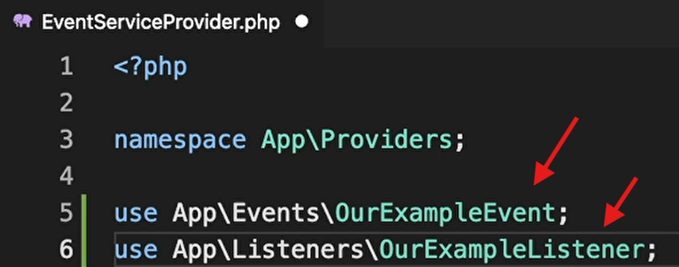

# Udemy - Let's Learn Laravel A Guided Path For Beginners 2023

## Commands

```bash
php artisan serve --host=somedomain.com --port=8001
```

---

## Migration

instead of

```php
$table->foreignId('user_id');
```


## Seeder

```php
DB::table('users')->insert([
    'id' => 1,
    'username' => 'brad',
    'email' => 'brad@local',
    'password' => Hash::make('qwertyqwerty'), // pay attention to this
    'isAdmin' => 1
]);

```

## Middleware

Path: \bootstrap\app.php


```bash
php artisan make:middleware MiddleWareName
```


## Policy

Path: app/policies

```bash
php artisan make:policy ModelNamePolicy –-model=ModelName
```


## Moderator and gate

Path: app/policies


## Gate

Path: app/providers/AuthServiceProvider


## Request


## php basics


## Register


## Log in


## Log out


## Repository

```php
Auth()->user()->username or id
```


```php
$user -> delete()
$user -> update($incomingFields)
```

---


Let's say in your user table you have a field that is user_type and that can have values of user / admin

Obviously, you don't want users to be able to update this value. someone could inject into a form a new field for user_type and send 'admin' along with the other form data, and easily switch their account to an admin account... bad news.

By adding:

```php
$fillable = ['name', 'password', 'email'];
```

You are ensuring that only those values can be updated using mass assignment

To be able to update the user_type value, you need to explicitly set it on the model and save it, like this:

```php
$user->user_type = 'admin';
$user->save();
```

---

```php
$existCheck = Follow::where(some query)->count(); // pay attention to count!
```

> ```php
> $user->isEmpty(); // pay attention to isEmpty()!
> ```

> 

## models


## Relations


## Search

show us all blog posts that contain the word "Brad". we're not saying, only show us posts where the entire value for the title column is literally nothing but the word "Brad", We're trying to say if the value in there if at any point it contains the word "Brad" inside it. Now, there are many different ways to accomplish this


```bash
composer require laravel/scout
```

> ```bash
> php artisan vendor:publish --provider="Laravel\Scout\ScoutServiceProvider"
> ```
>
> Laravel will look for any publishable resources (such as configuration files, views, assets, translations, or migrations) that have been tagged by the service provider named "SomeThing" and copy them from the package’s directory into your application. This allows you to customize and override package resources in your own project without modifying the package’s source code. Essentially, it "publishes" the package’s files into your app’s directory structure, making them accessible for further development or customization.


> in .env file:
> 
> this is one of the search solutions and we have more: algolia and ...


## Events and listeners




```bash
php artisan event:generate
```


## Tips

```php
Log::info
```

```bash
php artisan cache:forget spatie.permission.cache
```

```bash
php artisan optimize:clear
php artisan optimize
php artisan clear-compiled
php artisan config:cache
php artisan route:cache
php artisan view:cache
composer dump-autoload
npm cache clean --force
```
